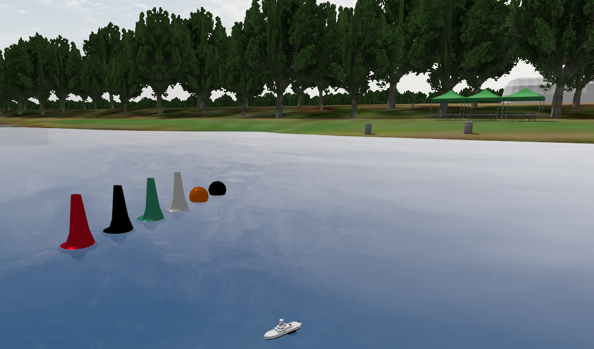

# Tuna boat on Virtual RobotX (VRX) Simulator



This is a tuna boat 

https://github.com/MoffKalast/tuna

This is VRX simulator

https://github.com/osrf/vrx


## Getting Started with VRX

 * Watch the [Release 2.3 Highlight Video](https://vimeo.com/851696025).
 * The [VRX Wiki](https://github.com/osrf/vrx/wiki) provides documentation and tutorials.
 * The instructions assume a basic familiarity with the ROS environment and Gazebo.  If these tools are new to you, we recommend starting with the excellent [ROS Tutorials](http://wiki.ros.org/ROS/Tutorials)
 * For technical problems, please use the [project issue tracker](https://github.com/osrf/vrx/issues) to describe your problem or request support.


## How to run Tuna boat on VRX

### run

```
ros2 launch vrx_gz competition.launch.py world:=sydney_regatta model:=tuna name:=tuna urdf:=tuna
```
### build 

```
colcon build --merge-install; source install/setup.bash
```

### To move the robot with thruster directly
vrx thruster command 

```
ros2 topic pub /tuna/thrusters/tuna_left/thrust std_msgs/msg/Float64 "{data: 1.0}" -r 1
```

```
ros2 topic pub /tuna/thrusters/tuna_right/thrust std_msgs/msg/Float64 "{data: 1.0}" -r 1
```
